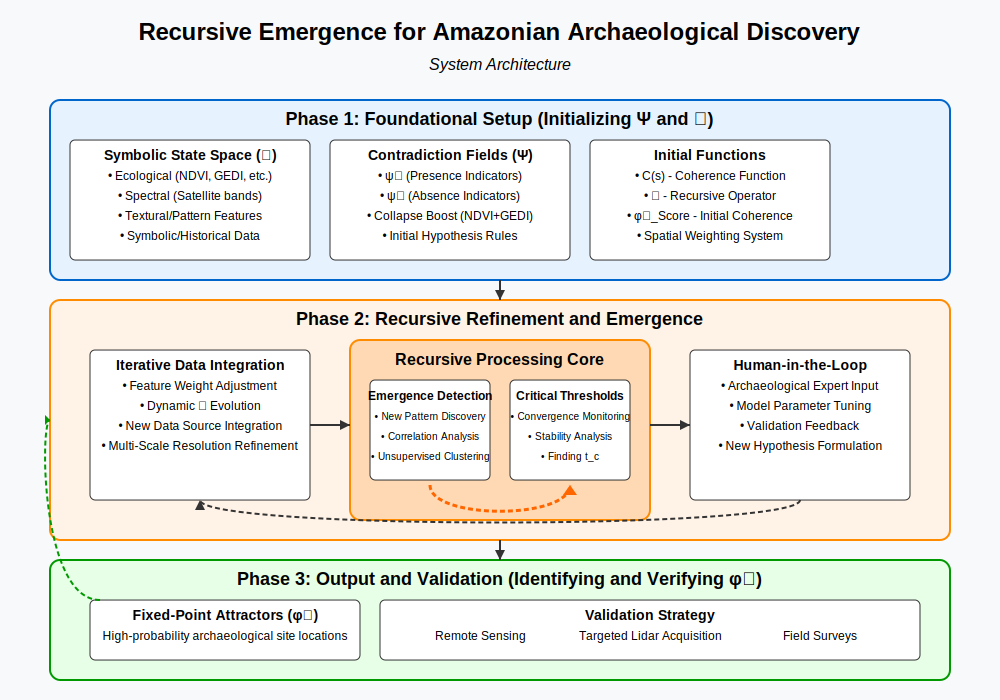

## Introducing Our Method: Recursive Emergence (RE)

**How can we discover something that’s not only hidden—but never fully recorded?**
Our answer: treat the Amazon not as a blank map, but as a recursive memory system.

We use a method called **Recursive Emergence (RE)**—a framework originally developed (https://github.com/Recursive-Emergence/RE)to explain how structure arises across biology, cognition, and society. In this challenge, we apply it to **archaeological discovery**.

---

### What is Recursive Emergence?

**RE models how patterns build on previous ones to create new, coherent structures.**
Imagine how a village road hints at a plaza, and a plaza hints at farmland and fishponds. RE captures that logic:

* It begins with **compressed motifs** from known sites (like Kuhikugu or Casarabe)
* It **projects** them onto unexplored regions, using both structure and environmental constraints
* It applies recursive feedback to refine predictions as new evidence emerges

In short, RE doesn’t just say *“this looks weird.”*
It asks *“what structure must be here, if this system evolved coherently?”*

---

### Why Use RE?

Unlike traditional detection methods that search for anomalies, RE searches for **emergent coherence**:

* It **combines multiple data sources**—LIDAR, satellite, historical texts, oral maps
* It **builds hypotheses** that are spatially and culturally grounded
* It **learns recursively**—each discovery improves the next prediction

Our method ranks candidate sites not just on similarity, but on **emergence potential**:
```math
P(\Phi) = R(\Phi) \cdot \Delta H \cdot S(\Phi, \Omega)
```

* **R** = how reusable the pattern is (motif recurrence)
* **ΔH** = how much entropy it reduces (does it explain confusion?)
* **S** = how well it fits the spatial/historical/terrain lattice

---


### Why It Matters

RE helps us not only rediscover the past, but **reconstruct how it made sense to the people who built it**.
It offers a new tool: one that’s explainable, generative, and adaptive.
And because RE is **recursive**, each discovery seeds the next—like memory itself.


The goal is to move beyond simple data overlay and scoring, and instead create a system that *recursively refines its understanding* of what constitutes a potential archaeological site in the Amazonian context.

**Overall Strategy: Recursive Emergence for Amazonian Archaeological Discovery**

This strategy aims to find coherent attractor states ($\phi^0$) representing high-probability archaeological sites, by iteratively resolving contradiction fields ($\Psi$) derived from diverse geospatial and symbolic data.

**Phase 1: Foundational Setup (Analogous to Initializing $\Psi$ and $\mathcal{R}$)**

1.  **Define the Symbolic State Space ($\mathcal{S}$):**
    *   **Elements:** Each "state" $s \in \mathcal{S}$ will be a geospatial grid cell (e.g., 1km x 1km, or a dynamic resolution) characterized by a vector of features.
    *   **Features:**
        *   **Ecological:** NDVI (vegetation health), GEDI canopy height (structure), elevation, slope, aspect, soil type, proximity to water sources (rivers, paleochannels).
        *   **Spectral:** Other satellite bands that might indicate soil disturbance, specific vegetation types associated with human activity (e.g., palm groves, bamboo).
        *   **Textural/Pattern:** Measures of landscape homogeneity/heterogeneity, detection of geometric patterns (lines, enclosures) from high-resolution imagery if available for certain areas.
        *   **Symbolic/Historical:** Proximity to known archaeological sites (like Kuhikugu, Landívar, Cotoca), alignment with historical accounts, oral traditions, or "mythic zones" (as in your notebook).

2.  **Define Initial Contradiction Fields ($\Psi = (\psi^+, \psi^-)$):**
    *   These are hypotheses about what constitutes an anomaly indicative of human presence.
    *   **Example $\psi^+$ (Presence Indicator):** High NDVI (regrowth), low canopy height (clearing), specific soil composition, geometric earthworks, proximity to ancient riverbeds.
    *   **Example $\psi^-$ (Absence Indicator / Natural State):** High NDVI, high canopy height (undisturbed primary forest), typical regional soil, lack of geometric patterns, distance from known resources.
    *   The notebook's "collapse boost" (high NDVI + low GEDI) is a prime example of a $\Psi$ component.

3.  **Define the Coherence Function ($C$):**
    *   This function $C(s) \to [0,1]$ will score each grid cell $s$ based on how strongly it aligns with patterns indicative of archaeological sites.
    *   Initially, this could be a weighted sum or a more complex model (e.g., a simple machine learning classifier trained on known sites if enough data exists, or a rule-based system derived from archaeological expertise).
    *   The `φ⁰_Score` in your notebook is a basic coherence function.

4.  **Define the Initial Recursive Operator ($\mathcal{R}$):**
    *   This operator will take the current set of scored grid cells (representing the system's current "understanding") and refine it.
    *   **Initial $\mathcal{R}$ components:**
        *   Applying the `apply_collapse_boost` and `myth_proximity_boost`.
        *   Normalizing and combining feature scores.

**Phase 2: Recursive Refinement and Emergence (Iterative Application of $\mathcal{R}$ to reach $\phi^0$)**

This is where the RE framework truly comes into play, moving beyond a static model.

1.  **Iterative Data Integration & Weight Adjustment:**
    *   **Feedback Loop:** As high-coherence zones ($\approx \phi^0$ candidates) are identified, use their characteristics to refine the coherence function $C$ and the contradiction definitions $\Psi$.
        *   If initial "hits" are validated (e.g., by high-resolution imagery or preliminary surveys), increase the weight of the features that led to their discovery.
        *   If initial "hits" are false positives (e.g., natural clearings), adjust $C$ or $\Psi$ to down-weight those misleading signatures.
    *   **Dynamic $\mathcal{R}$:** The recursive operator itself evolves. For example, the thresholds for "high NDVI" or "low GEDI" in the `apply_collapse_boost` might be learned or adjusted based on regional variations or feedback.

2.  **Exploring for Emergent Structures (Conjecture 3):**
    *   The system shouldn't just find what it's explicitly told to look for.
    *   **Mechanism:** Introduce mechanisms for the system to identify *new, unexpected correlations* between features in high-coherence zones. This could involve unsupervised clustering on the feature vectors of candidate sites.
    *   If a new cluster of features consistently appears in promising locations, this could represent an "emergent structure" – a new type of archaeological signature not initially programmed. This new signature would then be incorporated into $\Psi$ and $C$.

3.  **Identifying Critical Thresholds ($t_c$) (Conjecture 4):**
    *   Monitor the convergence of the system. Initially, the map of potential sites might be noisy and widespread ($\mathcal{R}_t(\Psi)$ oscillating).
    *   As the recursive process continues and the model refines, the system should ideally converge, with high-coherence zones becoming more stable and well-defined (approaching $\phi^0$).
    *   The "critical threshold" $t_c$ could be the point where the set of top candidate sites stabilizes significantly across iterations.

4.  **Multi-Scale Recursion:**
    *   Start with a coarse resolution (like the 5km in your notebook) for broad area survey.
    *   Recursively apply the RE process at finer resolutions *within* the high-coherence zones identified at coarser scales. This creates a hierarchical search strategy.
    *   The definition of $\Psi$ and $C$ might change with scale (e.g., textural patterns are more relevant at finer scales).

5.  **Incorporating the "Human-in-the-Loop" into $\mathcal{R}$:**
    *   Archaeological expertise is crucial. Expert evaluation of candidate sites, interpretation of ambiguous data, and suggestions for new data sources or contradiction rules can be explicitly incorporated as steps within the recursive operator $\mathcal{R}$.
    *   This makes $\mathcal{R}$ a collaborative human-AI process.

**Phase 3: Output and Validation (Identifying and Verifying $\phi^0$)**

1.  **Attractor State Identification ($\phi^0$):**
    *   The final output is a set of stable, high-coherence grid cells or regions ($\phi^0$ attractors) that represent the most promising candidate locations for archaeological sites.
    *   These are not just static scores but locations that have remained stable and highly coherent through multiple iterations of refinement.

2.  **Validation Strategy:**
    *   **Remote Sensing Validation:** Detailed analysis of high-resolution satellite imagery (optical, SAR) and digital elevation models (DEMs) for the $\phi^0$ candidate zones.
    *   **Targeted Lidar Acquisition:** If possible, commission Lidar surveys over the most promising $\phi^0$ zones.
    *   **Field Surveys:** Ultimately, ground-truthing through archaeological fieldwork is essential.

**Connecting to Your Theoretical Framework:**

*   The **Symbolic State Space ($\mathcal{S}$)** is the gridded Amazon with its multi-layer data.
*   **Contradiction Fields ($\Psi$)** are the specific data patterns (e.g., NDVI/GEDI mismatch, specific soil types near paleochannels) that challenge the "null hypothesis" of a purely natural landscape.
*   The **Coherence Function ($C$)** quantifies how much a given location resembles known or hypothesized archaeological signatures.
*   The **Recursive Operator ($\mathcal{R}$)** is the entire iterative process of data integration, model refinement, expert input, and multi-scale analysis.
*   The **Fixed-Point Attractors ($\phi^0$)** are the stable, high-confidence locations that emerge from this recursive process, representing the system's most coherent "understanding" of where sites might be.

This strategy emphasizes that RE is not a one-shot analysis but an ongoing process of learning and refinement, aiming to uncover complex patterns that simpler methods might miss. The key is the iterative feedback loop where the system's own discoveries and expert knowledge continually reshape its search parameters.

# Architecture Diagram

